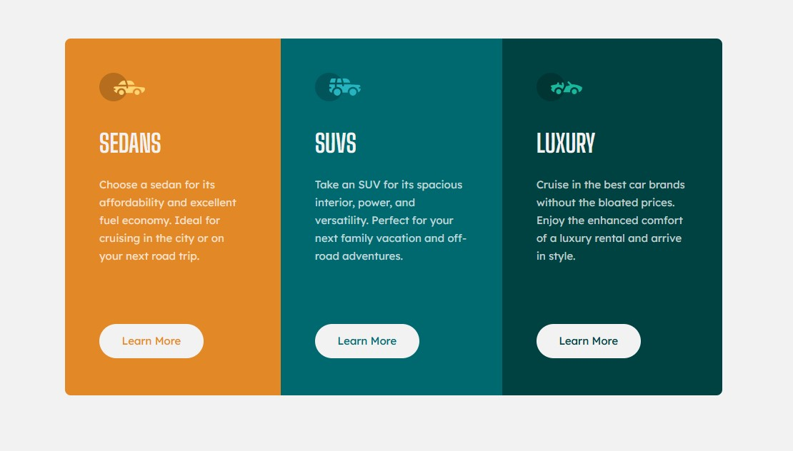

# Frontend Mentor - 3-column preview card component solution

This is a solution to the [3-column preview card component challenge on Frontend Mentor](https://www.frontendmentor.io/challenges/3column-preview-card-component-pH92eAR2-). Frontend Mentor challenges help you improve your coding skills by building realistic projects.

## Table of contents

- [Overview](#overview)
  - [The challenge](#the-challenge)
  - [Screenshot](#screenshot)
  - [Links](#links)
- [My process](#my-process)
  - [Built with](#built-with)
  - [What I learned](#what-i-learned)
  - [Continued development](#continued-development)
- [Author](#author)

## Overview

### The challenge

Users should be able to:

- View the optimal layout depending on their device's screen size
- See hover states for interactive elements

### Screenshot

### Links

- Solution URL: [https://www.frontendmentor.io/solutions/3-column-preview-card-component-ithvzljKum](https://www.frontendmentor.io/solutions/3-column-preview-card-component-ithvzljKum)
- Live Site URL: [https://lmarchesoti.github.io/frontendmentor.io/3-column-preview-card-component/](https://lmarchesoti.github.io/frontendmentor.io/3-column-preview-card-component/)

## My process

### Built with

- Semantic HTML5 markup
- CSS
- Flexbox

### What I learned

Using the responsive CSS properties makes everything a breeze :)
Also done using the new Figma Dev Mode, which makes everything much more of a breeze.

### Continued development

I would like to tackle more complex challenges involving responsive layout.

## Author

- LinkedIn - [lmarchesoti](https://www.linkedin.com/in/lmarchesoti/)
- Frontend Mentor - [@lmarchesoti](https://www.frontendmentor.io/profile/lmarchesoti)
