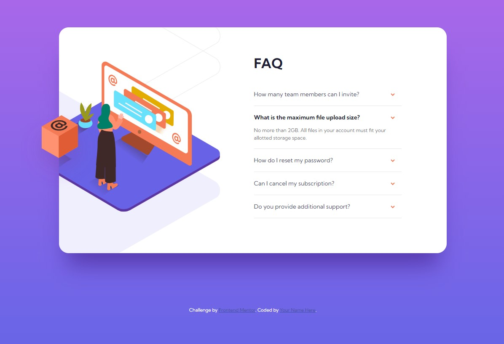

# Frontend Mentor - FAQ accordion card solution

This is a solution to the [FAQ accordion card challenge on Frontend Mentor](https://www.frontendmentor.io/challenges/faq-accordion-card-XlyjD0Oam). Frontend Mentor challenges help you improve your coding skills by building realistic projects.

## Table of contents

- [Overview](#overview)
  - [The challenge](#the-challenge)
  - [Screenshot](#screenshot)
  - [Links](#links)
- [My process](#my-process)
  - [Built with](#built-with)
  - [What I learned](#what-i-learned)
  - [Continued development](#continued-development)
- [Author](#author)

## Overview

### The challenge

Users should be able to:

- View the optimal layout for the component depending on their device's screen size
- See hover states for all interactive elements on the page
- Hide/Show the answer to a question when the question is clicked

### Screenshot

### Links

- Solution URL: [https://www.frontendmentor.io/solutions/faq-accordion-card-hEaKdDS1d-](https://www.frontendmentor.io/solutions/faq-accordion-card-hEaKdDS1d-)
- Live Site URL: [https://lmarchesoti.github.io/frontendmentor.io/faq-accordion-card/](https://lmarchesoti.github.io/frontendmentor.io/faq-accordion-card/)

## My process

### Built with

- Semantic HTML5 markup
- Flexbox
- CSS Grid

### What I learned

I had a really tough time with the responsive desktop image. Coordinating the resizing and positioning of 3 images, as well as the complex overlapping they show on the left, was no easy task. It took me DAYS!!! XD

But now my image positioning muscles are much stronger, and I won the mobile version with little effort :)

### Continued development

This was a really tough project in terms of working with images. I know background images are still a nightmare to me, but I wonder if I'm still so far away from overcoming image sizing and positioning.

## Author

- LinkedIn - [lmarchesoti](https://www.linkedin.com/in/lmarchesoti/)
- Frontend Mentor - [@lmarchesoti](https://www.frontendmentor.io/profile/lmarchesoti)
