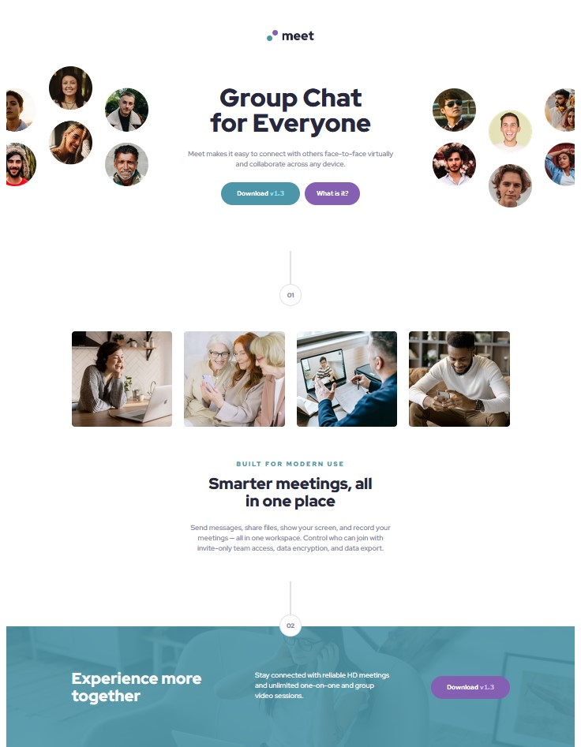

# Frontend Mentor - Meet landing page solution

This is a solution to the [Meet landing page challenge on Frontend Mentor](https://www.frontendmentor.io/challenges/meet-landing-page-rbTDS6OUR). Frontend Mentor challenges help you improve your coding skills by building realistic projects.

## Table of contents

- [Overview](#overview)
  - [The challenge](#the-challenge)
  - [Screenshot](#screenshot)
  - [Links](#links)
- [My process](#my-process)
  - [Built with](#built-with)
  - [What I learned](#what-i-learned)
  - [Continued development](#continued-development)
- [Author](#author)

## Overview

### The challenge

Users should be able to:

- View the optimal layout depending on their device's screen size
- See hover states for interactive elements

### Screenshot

### Links

- Solution URL: [https://www.frontendmentor.io/solutions/meet-landing-page-UgDHgSpjLH](https://www.frontendmentor.io/solutions/meet-landing-page-UgDHgSpjLH)
- Live Site URL: [https://lmarchesoti.github.io/frontendmentor.io/meet-landing-page/](https://lmarchesoti.github.io/frontendmentor.io/meet-landing-page/)

## My process

### Built with

- HTML5
- CSS
- Flexbox
- CSS Grid

### What I learned

This challenge was tough :)
It was the most complex layout I have implemented so far, coming with a page dedicated to the design system on the figma file. The difference between the desktop and mobile/tablet versions on the header also gave me some headaches (no pun intended). I ended up not using the mobile hero image on the header, and just gluing together the other ones with the grid.

### Continued development

I see I can still improve a lot on my layout skills, especially when it comes to responsiveness.

## Author

- LinkedIn - [lmarchesoti](https://www.linkedin.com/in/lmarchesoti/)
- Frontend Mentor - [@lmarchesoti](https://www.frontendmentor.io/profile/lmarchesoti)
