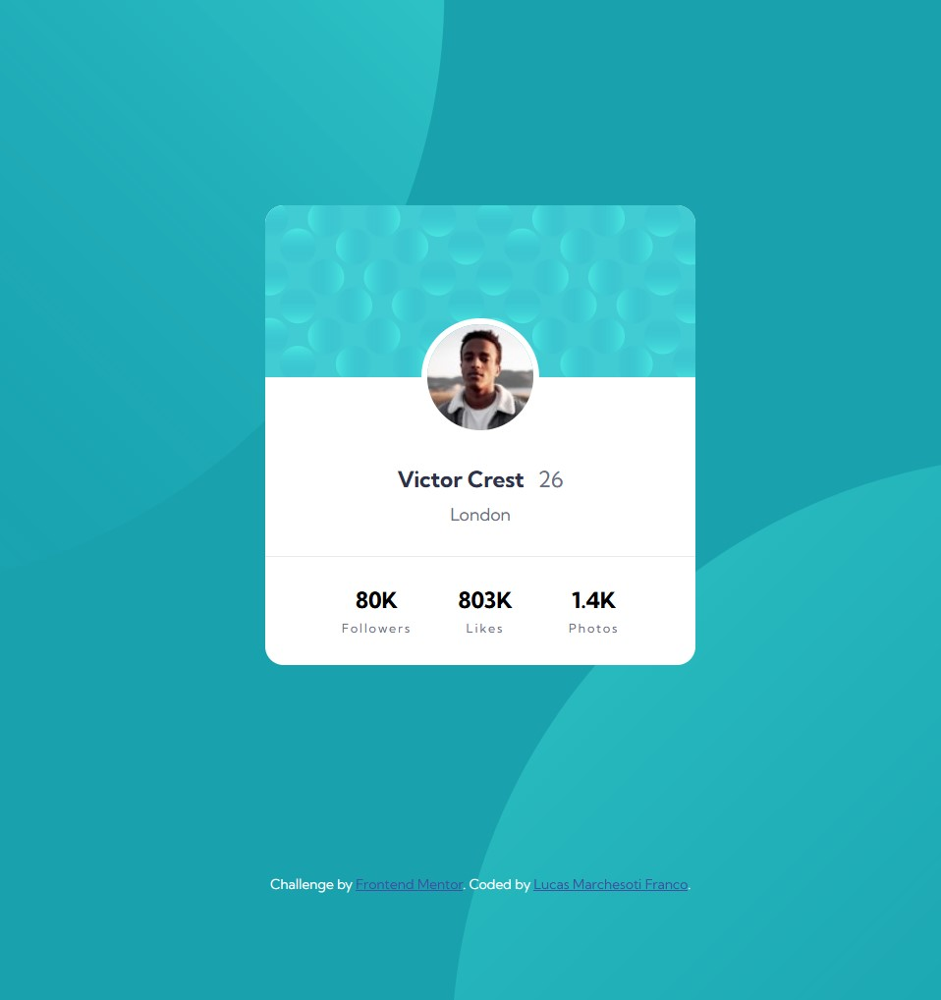

# Frontend Mentor - Profile card component solution

This is a solution to the [Profile card component challenge on Frontend Mentor](https://www.frontendmentor.io/challenges/profile-card-component-cfArpWshJ). Frontend Mentor challenges help you improve your coding skills by building realistic projects.

## Table of contents

- [Overview](#overview)
  - [The challenge](#the-challenge)
  - [Screenshot](#screenshot)
  - [Links](#links)
- [My process](#my-process)
  - [Built with](#built-with)
  - [What I learned](#what-i-learned)
  - [Continued development](#continued-development)
- [Author](#author)

## Overview

### The challenge

- Build out the project to the designs provided

### Screenshot

### Links

- Solution URL: [https://www.frontendmentor.io/challenges/profile-card-component-cfArpWshJ/hub](https://www.frontendmentor.io/challenges/profile-card-component-cfArpWshJ/hub)
- Live Site URL: [https://lmarchesoti.github.io/frontendmentor.io/profile-card-component/](https://lmarchesoti.github.io/frontendmentor.io/profile-card-component/)

## My process

### Built with

- Semantic HTML5 markup
- CSS
- Flexbox
- Mobile-first workflow

### What I learned

This background was hell! I even used calc to position it correctly, which is probably not the best way, but it's what got me going. In my defense, there is another way to do it using negative margin and padding, but I'll leave it at that. Maybe next time I'll try it...

### Continued development

I got very surprised at how hard the background was, so I probably need to focus on it more.  
I also learned some new absolute positioning tricks, and I think I'll probably learn new ones as I get more experience with these layouts.

## Author

- LinkedIn - [lmarchesoti](https://www.linkedin.com/in/lmarchesoti/)
- Frontend Mentor - [@lmarchesoti](https://www.frontendmentor.io/profile/lmarchesoti)
