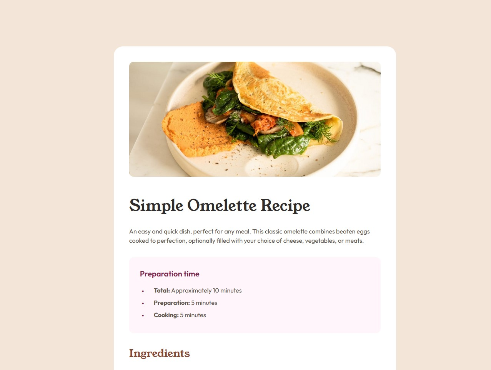

# Frontend Mentor - Recipe page solution

This is a solution to the [Recipe page challenge on Frontend Mentor](https://www.frontendmentor.io/challenges/recipe-page-KiTsR8QQKm). Frontend Mentor challenges help you improve your coding skills by building realistic projects.

## Table of contents

- [Overview](#overview)
  - [The challenge](#the-challenge)
  - [Screenshot](#screenshot)
  - [Links](#links)
- [My process](#my-process)
  - [Built with](#built-with)
- [Author](#author)
- [Acknowledgments](#acknowledgments)

## Overview

### Screenshot

### Links

- Solution URL: [https://www.frontendmentor.io/solutions/recipe-page-Hk-fNIRdL4](https://www.frontendmentor.io/solutions/recipe-page-Hk-fNIRdL4)
- Live Site URL: [https://lmarchesoti.github.io/frontendmentor.io/recipe-page/](https://lmarchesoti.github.io/frontendmentor.io/recipe-page/)

## My process

### Built with

- Semantic HTML5 markup
- Sass
- BEM

## Author

- LinkedIn - [lmarchesoti](https://www.linkedin.com/in/lmarchesoti/)
- Frontend Mentor - [@lmarchesoti](https://www.frontendmentor.io/profile/lmarchesoti)
