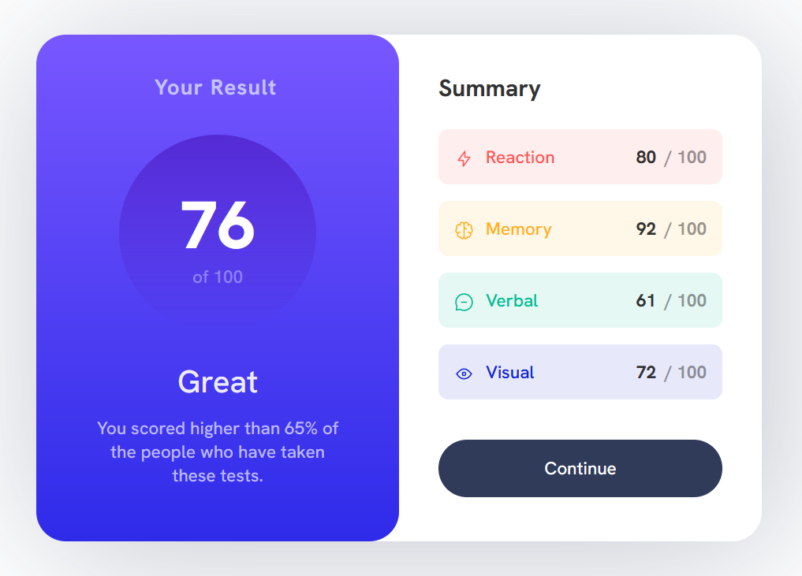

# Frontend Mentor - Results summary component solution

This is a solution to the [Results summary component challenge on Frontend Mentor](https://www.frontendmentor.io/challenges/results-summary-component-CE_K6s0maV). Frontend Mentor challenges help you improve your coding skills by building realistic projects.

## Table of contents

- [Overview](#overview)
  - [The challenge](#the-challenge)
  - [Screenshot](#screenshot)
  - [Links](#links)
- [My process](#my-process)
  - [Built with](#built-with)
  - [What I learned](#what-i-learned)
  - [Continued development](#continued-development)
- [Author](#author)

## Overview

### The challenge

Users should be able to:

- View the optimal layout for the interface depending on their device's screen size
- See hover and focus states for all interactive elements on the page

### Screenshot

### Links

- Solution URL: [https://www.frontendmentor.io/challenges/results-summary-component-CE_K6s0maV/hub](https://www.frontendmentor.io/challenges/results-summary-component-CE_K6s0maV/hub)
- Live Site URL: [https://lmarchesoti.github.io/frontendmentor.io/results-summary-component/](https://lmarchesoti.github.io/frontendmentor.io/results-summary-component/)

## My process

### Built with

- HTML
- CSS
- Flexbox

### What I learned

In this challenge I really struggled with the layout. I was trying to use vanilla CSS only, but then I started using Flexbox and manage do advance.  
The alignment of the list contents was a good test of my skills.

### Continued development

I think I can continue to improve on modern layout techniques such as Flexbox and Grid.

## Author

- LinkedIn - [lmarchesoti](https://www.linkedin.com/in/lmarchesoti/)
- Frontend Mentor - [@lmarchesoti](https://www.frontendmentor.io/profile/lmarchesoti)
