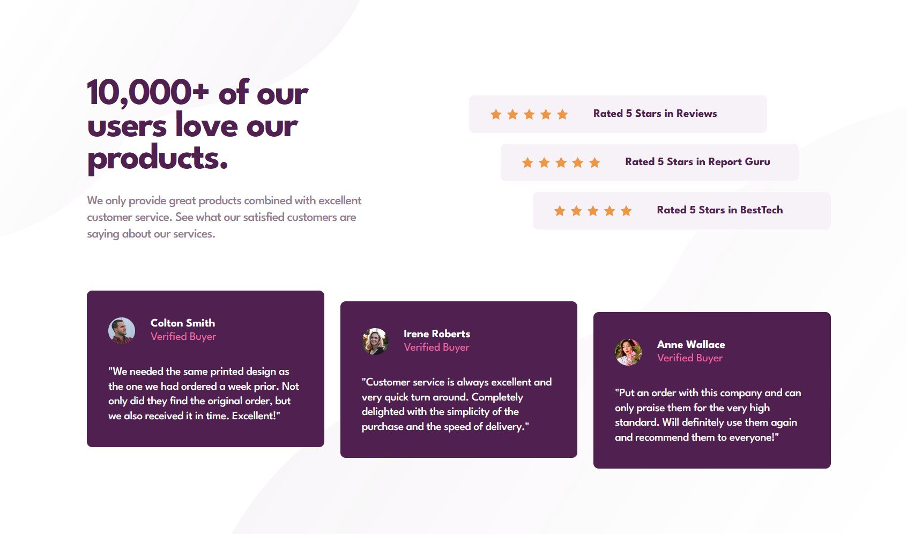

# Frontend Mentor - Social proof section solution

This is a solution to the [Social proof section challenge on Frontend Mentor](https://www.frontendmentor.io/challenges/social-proof-section-6e0qTv_bA). Frontend Mentor challenges help you improve your coding skills by building realistic projects.

## Table of contents

- [Overview](#overview)
  - [The challenge](#the-challenge)
  - [Screenshot](#screenshot)
  - [Links](#links)
- [My process](#my-process)
  - [Built with](#built-with)
  - [What I learned](#what-i-learned)
  - [Continued development](#continued-development)
- [Author](#author)

## Overview

### The challenge

Users should be able to:

- View the optimal layout for the section depending on their device's screen size

### Screenshot

### Links

- Solution URL: [https://www.frontendmentor.io/solutions/social-proof-section-Lf8fCfFK3M](https://www.frontendmentor.io/solutions/social-proof-section-Lf8fCfFK3M)
- Live Site URL: [https://lmarchesoti.github.io/frontendmentor.io/social-proof-section/](https://lmarchesoti.github.io/frontendmentor.io/social-proof-section/)

## My process

### Built with

- HTML5
- CSS
- Flexbox
- CSS Grid
- Mobile-first workflow

### What I learned

This challenge was awesome to improve my responsive layout skills!  
Using two background images was definitely new.

### Continued development

I can still improve on responsive layout skills.  
I could also improve on those inner alignments. I guess improving my mastery of more traditional properties such as _vertical-alignment_ and _float_ will go a long way.

## Author

- LinkedIn - [lmarchesoti](https://www.linkedin.com/in/lmarchesoti/)
- Frontend Mentor - [@lmarchesoti](https://www.frontendmentor.io/profile/lmarchesoti)
